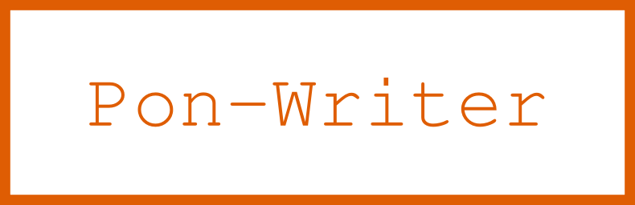

 


<!---
This file is generated by ape-tmpl. Do not update manually.
--->

<!-- Badge Start -->
<a name="badges"></a>

[![Build Status][bd_travis_shield_url]][bd_travis_url]
[![npm Version][bd_npm_shield_url]][bd_npm_url]
[![JS Standard][bd_standard_shield_url]][bd_standard_url]

[bd_repo_url]: https://github.com/realglobe-Inc/pon-writer
[bd_travis_url]: http://travis-ci.org/realglobe-Inc/pon-writer
[bd_travis_shield_url]: http://img.shields.io/travis/realglobe-Inc/pon-writer.svg?style=flat
[bd_travis_com_url]: http://travis-ci.com/realglobe-Inc/pon-writer
[bd_travis_com_shield_url]: https://api.travis-ci.com/realglobe-Inc/pon-writer.svg?token=
[bd_license_url]: https://github.com/realglobe-Inc/pon-writer/blob/master/LICENSE
[bd_codeclimate_url]: http://codeclimate.com/github/realglobe-Inc/pon-writer
[bd_codeclimate_shield_url]: http://img.shields.io/codeclimate/github/realglobe-Inc/pon-writer.svg?style=flat
[bd_codeclimate_coverage_shield_url]: http://img.shields.io/codeclimate/coverage/github/realglobe-Inc/pon-writer.svg?style=flat
[bd_gemnasium_url]: https://gemnasium.com/realglobe-Inc/pon-writer
[bd_gemnasium_shield_url]: https://gemnasium.com/realglobe-Inc/pon-writer.svg
[bd_npm_url]: http://www.npmjs.org/package/pon-writer
[bd_npm_shield_url]: http://img.shields.io/npm/v/pon-writer.svg?style=flat
[bd_standard_url]: http://standardjs.com/
[bd_standard_shield_url]: https://img.shields.io/badge/code%20style-standard-brightgreen.svg

<!-- Badge End -->


<!-- Description Start -->
<a name="description"></a>

File writer for pon

<!-- Description End -->


<!-- Overview Start -->
<a name="overview"></a>


<!-- Overview End -->


<!-- Sections Start -->
<a name="sections"></a>

<!-- Section from "doc/guides/01.Installation.md.hbs" Start -->

<a name="section-doc-guides-01-installation-md"></a>

Installation
-----

```bash
$ npm install pon-writer --save
```


<!-- Section from "doc/guides/01.Installation.md.hbs" End -->

<!-- Section from "doc/guides/02.Usage.md.hbs" Start -->

<a name="section-doc-guides-02-usage-md"></a>

Usage
---------

```javascript
'use strict'

const ponWriter = require('pon-writer')

async function tryExample () {
  let writer = ponWriter({})

  let { skipped } = await writer.write('foo/bar.txt', 'This is the contents of bar!', {
    mkdirp: true,
    skipIfIdentical: true
  })
  if (!skipped) {
    console.log('New file generated!')
  }
}

tryExample().catch((err) => console.error(err))

```


<!-- Section from "doc/guides/02.Usage.md.hbs" End -->

<!-- Section from "doc/guides/10.API Guide.md.hbs" Start -->

<a name="section-doc-guides-10-api-guide-md"></a>

API Guide
-----

+ [pon-writer@1.0.4](./doc/api/api.md)
  + [create(args)](./doc/api/api.md#pon-writer-function-create)
  + [PonWriter](./doc/api/api.md#pon-writer-class)


<!-- Section from "doc/guides/10.API Guide.md.hbs" End -->


<!-- Sections Start -->


<!-- LICENSE Start -->
<a name="license"></a>

License
-------
This software is released under the [Apache-2.0 License](https://github.com/realglobe-Inc/pon-writer/blob/master/LICENSE).

<!-- LICENSE End -->


<!-- Links Start -->
<a name="links"></a>

Links
------

+ [Pon][pon_url]
+ [Realglobe, Inc.][realglobe,_inc__url]

[pon_url]: https://github.com/realglobe-Inc/pon
[realglobe,_inc__url]: http://realglobe.jp

<!-- Links End -->
